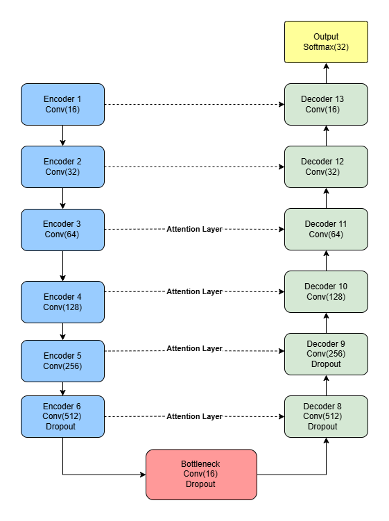
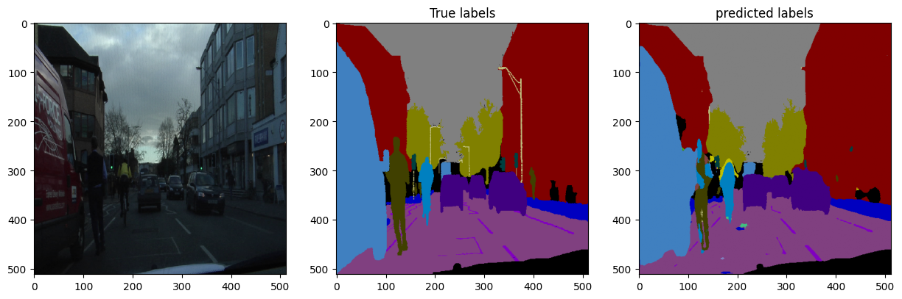
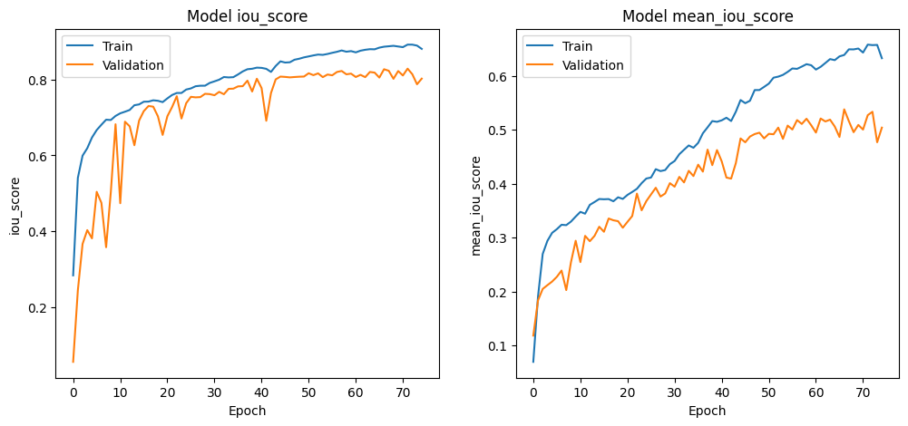
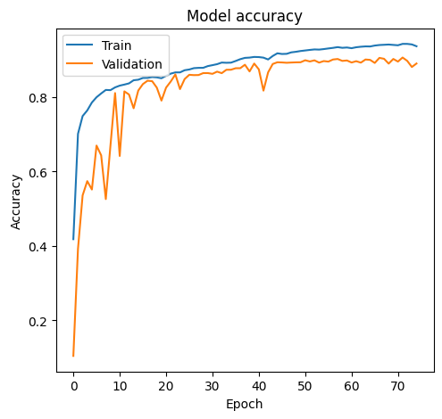

# U-Net for Road Scene Segmentation 🚗

Autonomous vehicles rely on accurate **scene understanding** to make safe driving decisions. This project demonstrates an **Enhanced U-Net** model for **semantic segmentation** of road scenes using the **CamVid dataset**.

---

## 🔍 Problem Statement

Self-driving cars must distinguish between **roads, pedestrians, vehicles, and obstacles** in diverse conditions like lighting changes, weather, and occlusions. Traditional U-Net performs well but struggles with real-world complexity.

**Goal:** Build a robust U-Net variant that achieves high segmentation accuracy while staying computationally efficient.

---

## 💡 Our Approach

We designed an **Enhanced U-Net** with:

- **Deep encoder–decoder structure** (6 levels).
- **Attention gates** on skip connections → focus on relevant features.
- **Dropout in deeper layers** → prevent overfitting.
- **Batch normalization** → faster convergence.

<p align="center">
  
</p>

---

## 📊 Results

Our model was trained for 75 epochs on the CamVid dataset using **Adam optimizer + learning rate scheduling**.

<p align="center">
  
</p>

**Final Test Metrics:**

- ✅ Accuracy: **93.25%**
- ✅ IoU: **0.874**
- ✅ Mean IoU: **0.639**
- ✅ Dice Coefficient: **0.709**

### 📈 Training Curves

- IoU & mIoU growth

<p align="center">
  
</p>

- Accuracy vs. Loss

<p align="center">
  
</p>

- Dice coefficient trend

<p align="center">
  
</p>

---

## ⚙️ Training Setup

- **Dataset**: [CamVid](https://www.kaggle.com/datasets/carlolepelaars/camvid) (701 labeled frames).
- **Framework**: TensorFlow/Keras (Colab with NVIDIA A100 GPU).
- **Loss Function**: Categorical Cross-Entropy.
- **Runtime**: ~5 hours for 75 epochs.

---

## 🚀 How to Run

```bash
# clone repo
git clone https://github.com/amriitasroy/unet-image-segmentation.git
cd unet

# run notebook
jupyter notebook Codebase.ipynb
```

---

## 📂 Repository Structure

```
unet/
│── README.md
│── Codebase.ipynb
│── results/             # Sample outputs & visuals
│   ├── unet_architecture.png
│   ├── test_images.png
|   |── iou
│   ├── mean_iou
│   └── dice_coefficient
│
```

---

## 🔮 Next Steps

- Test lightweight backbones (e.g., MobileNet) for real-time use.
- Explore **transformer-based segmentation** (SegFormer, Swin-UNet).
- Extend to **multi-modal inputs** (RGB + thermal).

---
## ✍️ Author

- Amrita Sinha Roy

If you use this work, please cite the project/report accordingly.


## 📜 License

MIT --- see [LICENSE](./LICENSE)
